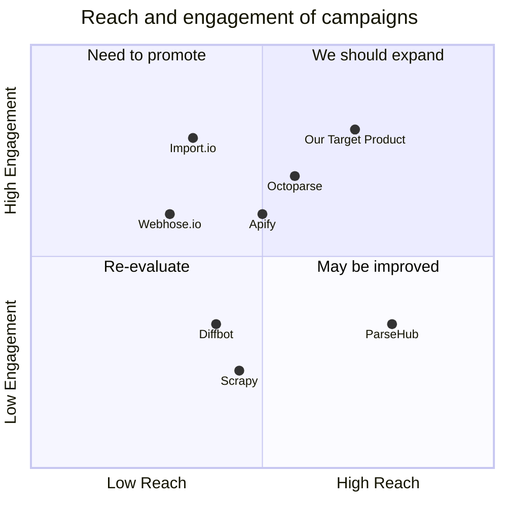

## Original Requirements
The boss has asked for the design of a crawler service for Taiwan's PTT, which can be operated and configured via LINE, including board selection and keyword tracking.

## Product Goals
```python
[
    "Create a crawler service that can efficiently scrape data from Taiwan's PTT",
    "Ensure the crawler service can be easily operated and configured via LINE",
    "Include features for board selection and keyword tracking in the crawler service"
]
```

## User Stories
```python
[
    "As a user, I want to be able to configure the crawler service via LINE so that I can easily manage the service",
    "As a user, I want to select which boards the crawler service should scrape data from so that I can focus on the areas I'm interested in",
    "As a user, I want to track specific keywords using the crawler service so that I can monitor discussions related to those keywords",
    "As a user, I want the crawler service to provide me with real-time updates so that I can stay informed about the latest discussions",
    "As a user, I want the crawler service to be efficient and reliable so that I can trust it to provide accurate data"
]
```

## Competitive Analysis
```python
[
    "Webhose.io: Offers a broad range of data sources, but does not provide a LINE interface for configuration",
    "Scrapy: A powerful open-source web crawling framework, but requires technical knowledge to configure and operate",
    "Octoparse: Provides a user-friendly interface, but lacks the ability to configure the service via LINE",
    "ParseHub: Supports a wide range of websites and data types, but does not offer board selection or keyword tracking features",
    "Diffbot: Uses machine learning to extract data, but is not specifically designed for Taiwan's PTT",
    "Import.io: Offers a comprehensive web scraping service, but lacks a LINE interface for configuration",
    "Apify: Provides a flexible platform for web scraping, but does not support configuration via LINE"
]
```

## Competitive Quadrant Chart


## Requirement Analysis
The product should be a crawler service designed specifically for Taiwan's PTT. It should be easily configurable and operable via LINE, with features for board selection and keyword tracking. The service should provide real-time updates and be efficient and reliable.

## Requirement Pool
```python
[
    ("Design a crawler service for Taiwan's PTT", "P0"),
    ("Ensure the service can be operated and configured via LINE", "P0"),
    ("Include features for board selection and keyword tracking", "P0"),
    ("The service should provide real-time updates", "P1"),
    ("Ensure the service is efficient and reliable", "P1")
]
```

## UI Design draft
The user interface should be simple and intuitive, with clear instructions for configuring the crawler service via LINE. It should include options for selecting boards and tracking keywords, with real-time updates displayed in an easy-to-read format. The layout should be clean and uncluttered, with a focus on usability.

## Anything UNCLEAR
There are no unclear points.