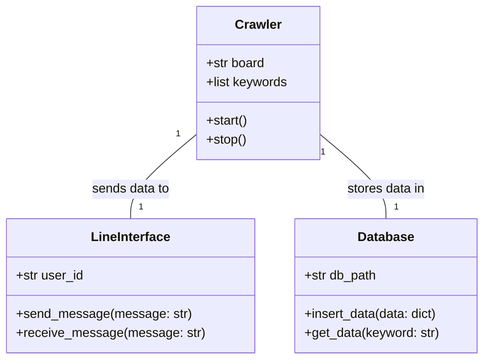
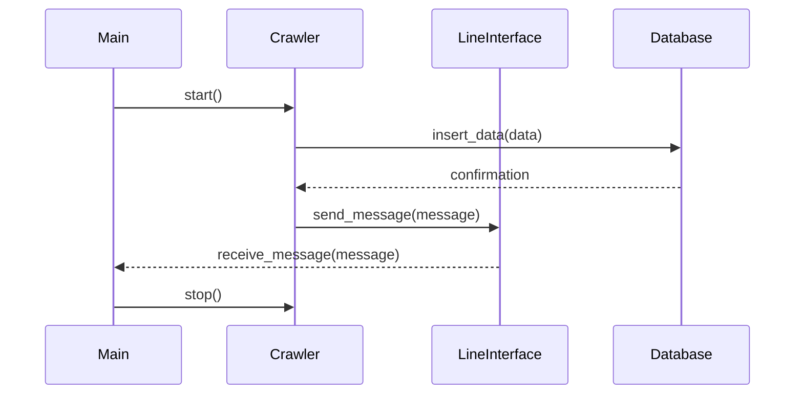

## Implementation approach
We will use Scrapy, an open-source Python framework, for the crawler service due to its robustness and flexibility. For the LINE interface, we will use line-bot-sdk, an open-source Python SDK for the LINE Messaging API. The crawler service will be designed to scrape data from Taiwan's PTT, with features for board selection and keyword tracking. We will use SQLite for data storage due to its simplicity and efficiency. The service will be designed to provide real-time updates to the user via LINE.

## Python package name
```python
"ptt_crawler_service"
```

## File list
```python
[
    "main.py",
    "crawler.py",
    "line_interface.py",
    "database.py",
    "config.py"
]
```

## Data structures and interface definitions


## Program call flow


## Anything UNCLEAR
The requirement is clear to me.